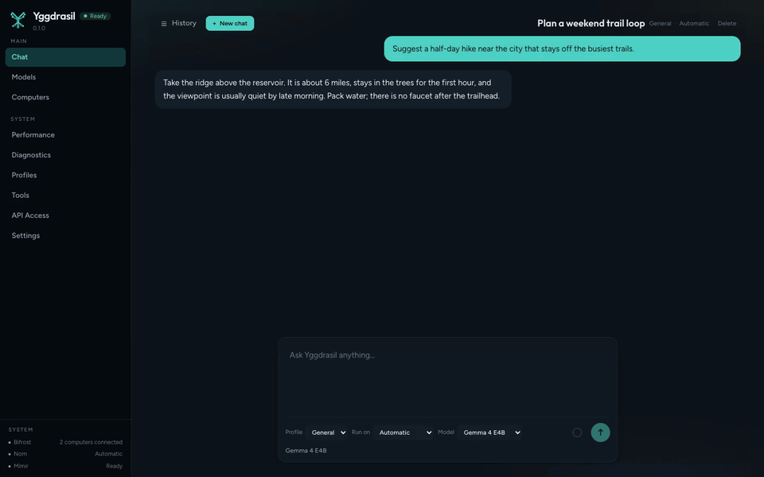
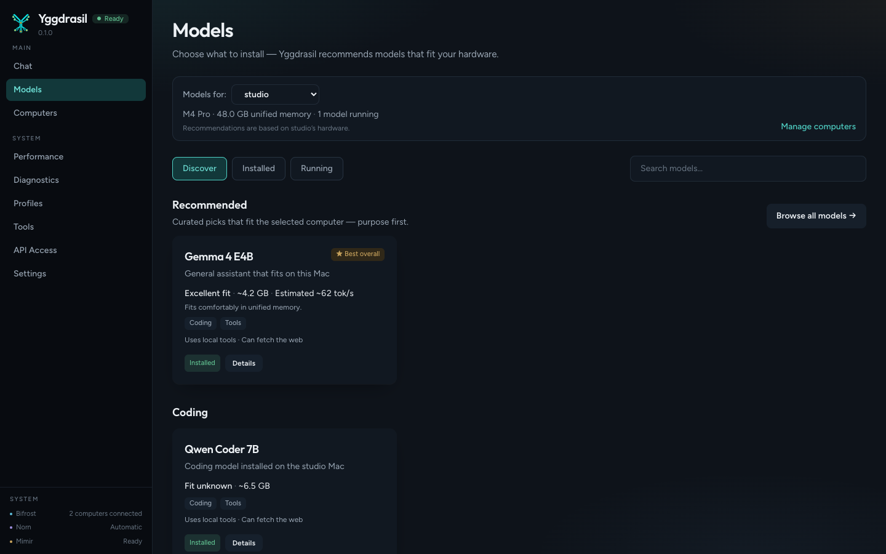
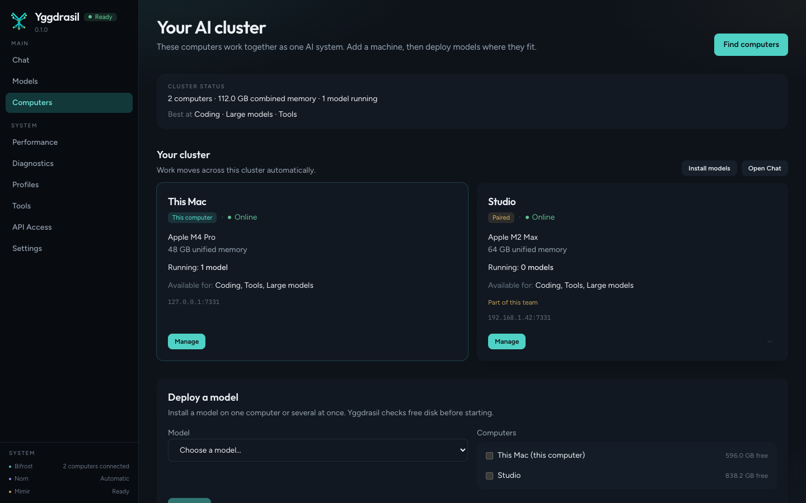
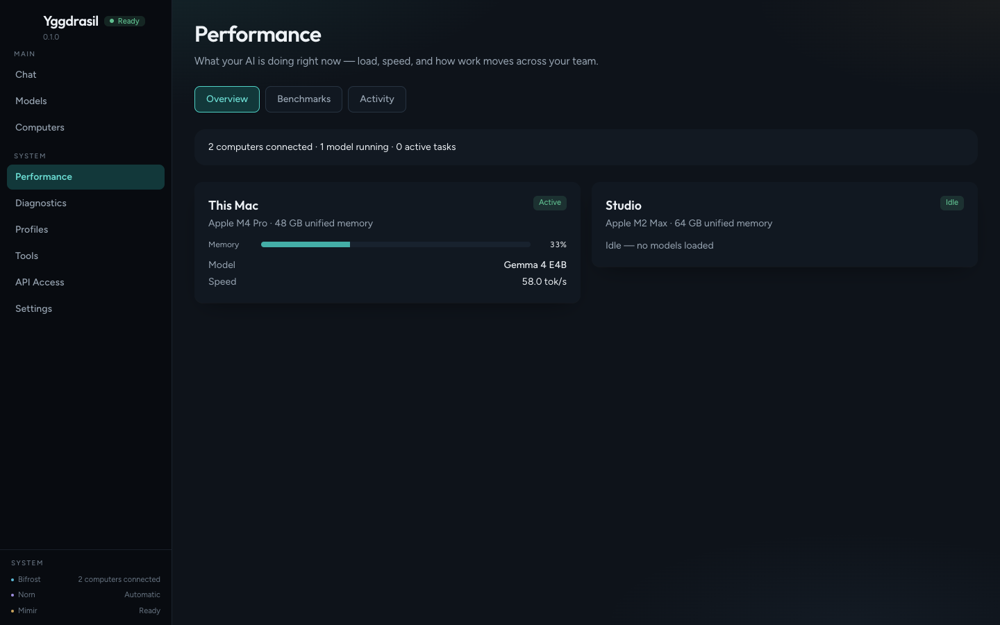
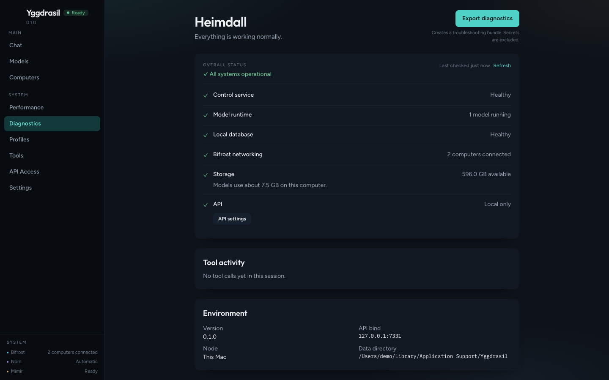
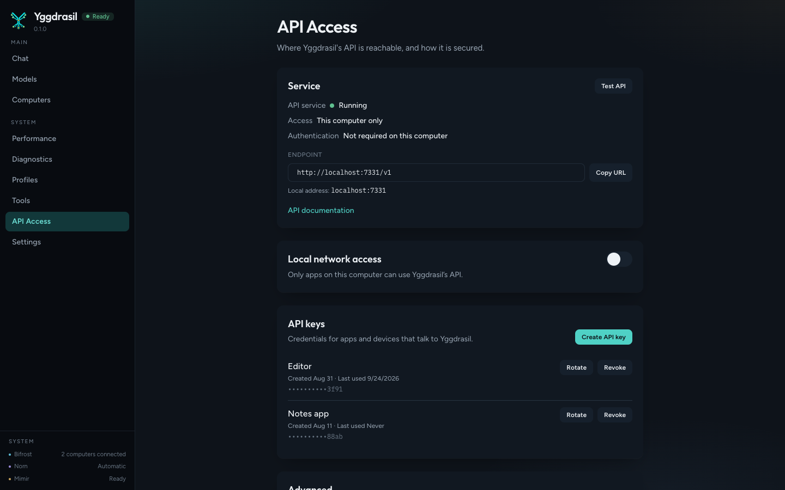

# Yggdrasil Core

<p align="center">
  <picture>
    <source media="(prefers-color-scheme: dark)" srcset="docs/brand/logo/yggdrasil-mark.svg">
    
  </picture>
</p>

> **Local AI should be as easy to use as SaaS AI.**

**An open-source control plane that makes local AI feel like a hosted AI service.**

Yggdrasil Core is built around one goal: make running AI on hardware you own feel as simple as using a hosted service.

You should not need to understand model formats, runtimes, GPU backends, memory limits, networking, or cluster scheduling just to use local AI.

Yggdrasil detects your hardware, recommends and manages models, starts the right runtime, uses other computers when needed, and exposes a consistent API to your applications. It manages models, runtimes, hardware, and multiple computers behind that API.

**Your computers. Your models. Your AI.**

The daemon (`yggdrasil-daemon`), the local web UI, and the HTTP API are in this repository. Yggdrasil Desktop and Yggdrasil Mobile are separate clients, developed outside this repository.

**Status:** Stable. See the latest [GitHub Release](https://github.com/yeixio/yggdrasil-core/releases).

[Quick start](#quick-start) · [Documentation](#documentation) · [Roadmap](ROADMAP.md) · [Contributing](CONTRIBUTING.md)

[](https://github.com/yeixio/yggdrasil-core/actions/workflows/ci.yml)
[](https://github.com/yeixio/yggdrasil-core/actions/workflows/security.yml)
[](https://github.com/yeixio/yggdrasil-core/actions/workflows/ci.yml)
[](LICENSE)

## Design principle

Yggdrasil is not trying to expose every local-AI knob.

It is trying to make those knobs unnecessary.

The default experience should be:

**Choose AI → Use AI**

Advanced controls should exist when needed, but users should not have to become AI infrastructure engineers to run models locally.

## Why Yggdrasil?

Hosted AI is easy:

1. Pick a model.
2. Send a request.
3. Get an answer.

Local AI often is not.

Before you can ask a question, you may need to understand model formats, quantization, runtime backends, GPU support, memory requirements, context sizes, ports, APIs, and which machine can actually run the model.

Yggdrasil's goal is to hide that complexity.

You choose what AI you want to use. Yggdrasil figures out how to run it on the hardware you own.

To make that possible, Core:

- detects the CPU, memory, storage, and accelerators available
- determines which models fit
- installs and manages model runtimes
- downloads and manages models
- starts and stops models when they are needed, and unloads them after they sit idle
- discovers other Yggdrasil computers
- places workloads on machines that can run them
- monitors model and node health
- exposes one consistent OpenAI-compatible API

<p align="center">
  <a href="docs/screenshots/demo.mp4">
    
  </a>
</p>

## Quick start

Open `http://127.0.0.1:7331` after the daemon is running. The API listens on `127.0.0.1:7331`. The first page can install a runtime and a GGUF model.

### macOS

Homebrew installs the Core daemon from this repository. Yggdrasil Desktop is a separate product. The Homebrew cask named `yggdrasil` is a different project.

```bash
brew tap yeixio/yggdrasil https://github.com/yeixio/yggdrasil-core
brew install yeixio/yggdrasil/yggdrasil
yggdrasil-daemon
```

A tagged release writes `Formula/yggdrasil.rb` and merges it to `main`. Headless archives are also attached to [GitHub Releases](https://github.com/yeixio/yggdrasil-core/releases). See [packaging/release-install.md](packaging/release-install.md).

### Linux

Debian and Ubuntu use the apt repository on the `apt` branch. That repository is unsigned.

```bash
echo "deb [trusted=yes] https://raw.githubusercontent.com/yeixio/yggdrasil-core/apt stable main" | sudo tee /etc/apt/sources.list.d/yggdrasil.list
sudo apt-get update
sudo apt-get install yggdrasil
```

The package installs `yggdrasil-daemon`, `yggctl`, the web UI, and `yggdrasil.service`. RPM packages for x86_64 and aarch64 are on the GitHub Release. Install one with `sudo rpm -i` or `sudo dnf install`. Details are in [packaging/linux/README.md](packaging/linux/README.md).

### Windows

The GitHub Release includes an unsigned `yggdrasil-<version>-windows-amd64-headless.tar.gz`. A source build is below.

### Build from source

Go 1.26.3 or newer, Node.js 22, and pnpm 9.

```bash
git clone https://github.com/yeixio/yggdrasil-core.git
cd yggdrasil-core
make start
```

`make start` installs web dependencies, builds the UI, builds the daemon, and runs it. Open `http://127.0.0.1:7331`. `make help` lists the other targets. `make frontend` is the same UI build plus the web tests. A build from this tree reports `0.1.0-dev` unless the version is set with `-ldflags`. See [docs/development.md](docs/development.md).

Dockerfiles in this repository are for development and the cluster check. Release archives are the packaged builds.

## Features

These exist in this repository today:

- headless daemon, with an optional local web UI
- hardware detection on macOS, Windows, and Linux
- GGUF model catalog, Hugging Face search, download, start, and stop
- llama.cpp (`llama-server`) runtime adapter, plus an adapter for an external OpenAI-compatible server
- **Auto** model choice: each request goes to a model that suits it (quick, coding, current information, or detailed), with a retry on another model when one fails
- profiles with a strategy (Auto, single model, planner + workers, or Team: a planner, workers spread over your computers, and a reviewer), model roles, and orchestration controls (effort, planning, verification, tool budget, memory, fallback order)
- persistent memory across chats and models, which you can review, edit, and turn off per chat
- Mimir connected knowledge: files, folders, uploads, scanned PDFs (text recognition), read-only SQL databases, and web APIs, searched by keyword and, with an embedding model, by meaning
- tools for web search, files, shell, Git, and making files, with per-profile Allow, Ask, and Deny policies; connected services (GitHub, Home Assistant); and tools from MCP servers
- Yggdrasil as an MCP server, so other AI apps can use it (`/mcp` and `yggctl mcp`)
- scheduled automations with conditional notifications, and a notification center
- Train your own AI: a guided build of a specialized assistant from a base model, LoRA training on your examples (MLX on Apple Silicon, PyTorch on NVIDIA GPUs), and connected knowledge, with base-versus-specialized testing before deployment, training on a paired computer, and export as a GGUF file. See [docs/features/train-your-own-ai.md](docs/features/train-your-own-ai.md).
- Bifrost discovery, pairing, and node-to-node calls, and Norn workload placement across paired nodes
- API keys with per-key permissions, a record of what left this computer, and run-record retention
- health endpoint, model health checks, diagnostics bundle, and a local event stream
- benchmarks against a running local model
- OpenAI-compatible `GET /v1/models` and `POST /v1/chat/completions`

Background work is idle model unload, model health checks, periodic peer refresh, and scheduled automations. A scheduled prompt runs in the daemon, including while the desktop window is closed when the app is set to keep running. How to use it is in the user guide. The v1 specification is [docs/features/completed/scheduler-and-automations.md](docs/features/completed/scheduler-and-automations.md).

## The interface

| | |
| --- | --- |
|  |  |
| Chat | Models |
|  |  |
| Computers | Performance |
|  |  |
| Diagnostics | API access |

`make screenshots` recaptures these stills and the walkthrough from demo data. It does not start a model. `make appstore-screenshots` writes the App Store sets from the same demo data: iPhone 6.9-inch at 1320×2868, iPad 13-inch at 2064×2752, and Mac at 2880×1800 and 2560×1600.

## How it works

Each computer runs its own daemon. Norn places a role on a machine that can run it. Bifrost discovers and pairs computers on the LAN.

```text
Apps / IDEs / Agents
        │
        ▼
  Yggdrasil Core
   ┌────┴────┐
   │  Norn   │ workload placement
   │ Bifrost │ discovery and pairing
   └────┬────┘
        │
   ┌────┴───────────────┐
   ▼                    ▼
This computer      Paired computers
   │                    │
   └──── local models ──┘
```

The API defaults to `127.0.0.1:7331`. Bifrost uses port 7332. Discovery uses mDNS (`_localai._tcp`) and can use static peers when mDNS is unavailable. Pairing asks for consent, then later node calls use certificates. Layout and the two-machine check are in [docs/architecture.md](docs/architecture.md), [docs/clustering.md](docs/clustering.md), and [docs/two-machine-team-demo.md](docs/two-machine-team-demo.md).

## OpenAI-compatible API

Base URL: `http://127.0.0.1:7331`

On the default loopback bind these routes do not require a key. If the daemon listens on any other address, send `Authorization: Bearer YOUR_API_KEY` on `/v1` and on `/api/v1`.

```bash
curl http://127.0.0.1:7331/v1/models
```

```bash
curl http://127.0.0.1:7331/v1/chat/completions \
  -H 'Content-Type: application/json' \
  -d '{"model":"profile:general-assistant","messages":[{"role":"user","content":"Hello"}]}'
```

`/v1/models` lists `auto`, profiles as `profile:<id>`, and deployed specialized AIs as `sai:<slug>`. Chat accepts any of those or a model id. Streaming uses server-sent events and ends with `data: [DONE]`. After a model is running, the examples under [examples/](examples/) call these routes. Compatibility limits are in [docs/api.md](docs/api.md).

## Supported platforms

| Platform | How to run it |
| --- | --- |
| macOS Apple Silicon and Intel | Homebrew, a darwin headless archive, or a source build |
| Linux amd64 and arm64 | `.deb`, `.rpm`, or a source build |
| Windows amd64 | Unsigned headless archive from the GitHub Release, or a source build |

## Supported hardware

The daemon inventories the host on macOS, Windows, and Linux, including NVIDIA, AMD, Intel, and Apple GPUs when the platform probes succeed. Detection is not a promise that inference has been measured on every combination. The matrix is in [docs/compatibility.md](docs/compatibility.md). A hardware report is a useful contribution.

## Supported runtimes

| Runtime id | What it is | Status |
| --- | --- | --- |
| `llamacpp` | Managed `llama-server` from llama.cpp GitHub releases. Models are GGUF. | Implemented |
| `external-openai` | A remote OpenAI-compatible base URL you configure. It is not installed as a local binary. | Implemented |

Asset selection is per OS and CPU architecture. The Windows asset the installer looks for is `bin-win-cpu-x64`. See [docs/runtimes.md](docs/runtimes.md).

## CLI

Installed and source builds both provide `yggdrasil-daemon` and `yggctl`.

```bash
yggdrasil-daemon
yggdrasil-daemon -version
yggctl version
yggctl about
yggctl paths
yggctl automations list
```

`yggctl version` and `yggctl about` print the version, the AGPL license, the source URL, and the commit. `yggdrasil-daemon -version` prints that notice and exits. `yggctl paths` prints the data, model, runtime, log, and database directories. Status, nodes, and models are HTTP routes under `/api/v1/`. `yggdrasil-daemon -data-dir /path/to/dir` overrides the data directory. Every command and flag is in [docs/cli.md](docs/cli.md).

### Shell completion

`yggctl` completes its commands in bash, zsh, and fish. Homebrew and the deb and rpm packages install the completion files, so a new shell picks them up. Bash needs the `bash-completion` package. The macOS and Linux archives carry the same files in `completions/`.

A source build prints the script for your shell:

```bash
# bash, in ~/.bashrc
eval "$(yggctl completion bash)"

# zsh. Add fpath=(~/.zfunc $fpath) before compinit in ~/.zshrc, then start a new shell.
mkdir -p ~/.zfunc
yggctl completion zsh > ~/.zfunc/_yggctl

# fish
yggctl completion fish > ~/.config/fish/completions/yggctl.fish
```

## Configuration

On first start the daemon writes `config.json` in the data directory.

| | |
| --- | --- |
| API | `127.0.0.1:7331` |
| Bifrost | port `7332`, on all interfaces when discovery is on (the default) |
| Web UI | enabled, when a built UI is found |
| LAN API | off |
| Discovery | on |

| OS | Data directory |
| --- | --- |
| macOS | `~/Library/Application Support/Yggdrasil` |
| Windows | `%LOCALAPPDATA%\Yggdrasil` |
| Linux | `$XDG_DATA_HOME/yggdrasil` or `~/.local/share/yggdrasil` |

Models, runtimes, logs, `yggdrasil.db`, and `secrets/` live under that path. `YGGDRASIL_*` variables override bind addresses, node identity, static peers, and discovery. Every key, variable, and setting is in [docs/configuration.md](docs/configuration.md). See also [docs/privacy.md](docs/privacy.md).

## Security and privacy

Yggdrasil Core does not send usage telemetry by default. A search of this repository found no analytics, crash-reporting, or metrics-upload client.

The control API and the OpenAI-compatible API require a bearer token whenever the daemon listens beyond loopback. Loopback access stays open by default. Yggdrasil refuses a non-loopback API until a key is configured. Enabling local network access records `0.0.0.0`; the socket changes on the next start, and the key check follows the configured host immediately. The Docker image sets `YGGDRASIL_API_HOST=0.0.0.0` and needs `YGGDRASIL_API_KEY`. A key on plain HTTP does not encrypt traffic. Bifrost listens for pairing on the LAN when discovery is enabled. Read [docs/privacy.md](docs/privacy.md) and [SECURITY.md](SECURITY.md) before exposing either port.

## Documentation

| | |
| --- | --- |
| [User guide](docs/user-guide/README.md) | Source for the public guide |
| [Troubleshooting](docs/troubleshooting.md) | First checks when something fails |
| [Configuration](docs/configuration.md) | Data directory, `config.json`, environment variables, settings |
| [CLI](docs/cli.md) | `yggdrasil-daemon` and `yggctl` |
| [Capabilities](docs/capabilities.md) | Internet, Files, Shell, Git, connected services, and MCP |
| [Tools](docs/tools.md) | Tool registry, permissions, and which tools a turn is offered |
| [MCP](docs/mcp.md) | Add tools from MCP servers, and use Yggdrasil from other AI apps |
| [Architecture](docs/architecture.md) | Subsystems and process layout |
| [API](docs/api.md) | Every route, the event stream, and the OpenAI-compatible API |
| [Runtimes](docs/runtimes.md) | llama.cpp and external servers |
| [Clustering](docs/clustering.md) | Discovery, pairing, placement |
| [Compatibility](docs/compatibility.md) | Hardware matrix |
| [Privacy](docs/privacy.md) | What stays local and what can leave |
| [Development](docs/development.md) | Build, test, lint, and CI |

The public site is [yggdrasil.yeix.io](https://yggdrasil.yeix.io). It reads the version index, guide snapshots, the latest GitHub release, and [`site/content.json`](site/content.json) from this repository.

### Feature specifications

Parts of these are built, as listed under [Features](#features). Each linked issue tracks what is still open.

- [Gjallarhorn notification system](docs/features/gjallarhorn-notification-system.md) (#39)
- [Expanded tool platform](docs/features/expanded-tool-platform.md) (#38)
- [Orchestration layer refactor](docs/features/orchestration-layer-refactor.md) (#41)

These are not implemented yet:

- [Kubernetes-native model deployment](docs/features/kubernetes-native-model-deployment.md)
- [Community model ratings](docs/features/community-model-ratings.md)
- [One-line node join](docs/features/one-line-node-join.md)
- [Multilingual localization and language routing](docs/features/multilingual-localization-and-language-routing.md)

Completed: [Scheduler and automations](docs/features/completed/scheduler-and-automations.md), [Train your own AI](docs/features/train-your-own-ai.md), [AI experience platform](docs/features/ai-experience-platform.md) (follow-ups in #111), [Persistent memory and cross-model context](docs/features/persistent-memory-and-cross-model-context.md).

### Research

This brief is not a commitment to build.

- [Distributed inference grid](docs/research/distributed-inference-grid-research.md)

## Roadmap

[ROADMAP.md](ROADMAP.md) separates what is in progress from research topics. It does not promise dates.

## Contributing

Hardware reports, runtime notes, documentation, and code all help. Read [CONTRIBUTING.md](CONTRIBUTING.md) before opening a pull request. Code contributions are covered by the [Yggdrasil Contributor License Agreement](CLA.md).

## Community

- **Questions and brainstorming:** [GitHub Discussions](https://github.com/yeixio/yggdrasil-core/discussions)
- **Bugs and actionable feature requests:** [GitHub Issues](https://github.com/yeixio/yggdrasil-core/issues)
- **Security vulnerabilities:** [SECURITY.md](SECURITY.md)
- **Contributing code:** [CONTRIBUTING.md](CONTRIBUTING.md)

[SUPPORT.md](SUPPORT.md) maps each kind of report to a form.

## Support Yggdrasil Core

If Yggdrasil Core is useful to you, you can support continued development through [GitHub Sponsors](https://github.com/sponsors/gopherstein). Contributions, testing, bug reports, documentation, and hardware compatibility reports are also valuable ways to support the project.

Nothing in the software is gated on a donation.

## Yggdrasil Desktop

Yggdrasil Core is the open-source engine. You can run the daemon and the web UI in this repository directly.

Yggdrasil Desktop and Yggdrasil Mobile are separate products. They are clients for people who want a packaged application. This repository does not contain their source. Desktop release artifacts are built outside this tree. The public site describes both products at [yggdrasil.yeix.io](https://yggdrasil.yeix.io).

## License

Copyright (C) 2026 YEIXIO LLC. Source code is [GNU Affero General Public License v3.0 or later](LICENSE). SPDX identifier: `AGPL-3.0-or-later`.

The copyright notice is in [NOTICE](NOTICE). Brand use is described in [TRADEMARKS.md](TRADEMARKS.md). Trademarks are not included in the license grant.
